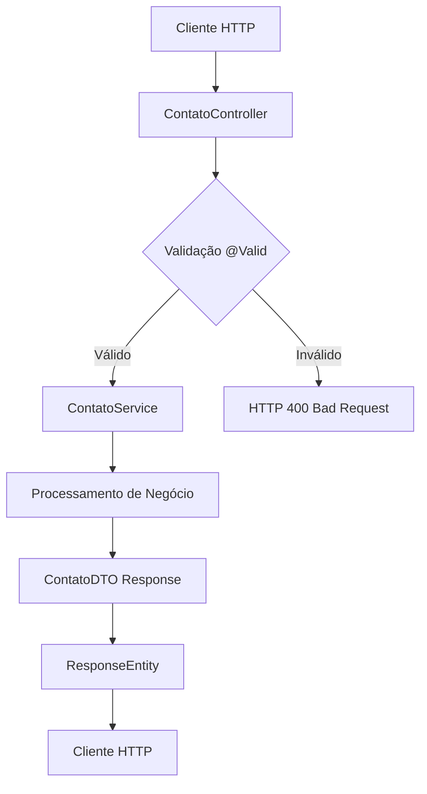
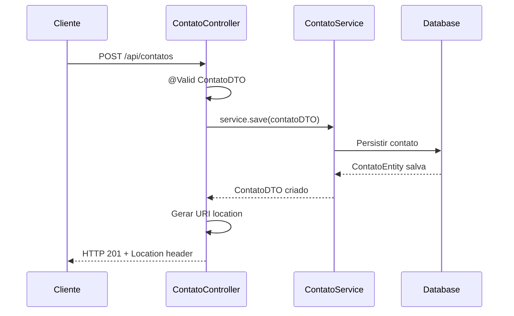

- [Encontrar bugs](#encontrar-bugs)
  - [**Problemas Identificados:**](#problemas-identificados)
    - [1. Falta de Tratamento de Exceções](#1-falta-de-tratamento-de-exceções)
    - [2. Falta de Validação de Entrada](#2-falta-de-validação-de-entrada)
    - [3. Falta de Sanitização de Entrada](#3-falta-de-sanitização-de-entrada)
    - [4. Ausência de Controle de Acesso](#4-ausência-de-controle-de-acesso)
    - [5. Falta de Paginação](#5-falta-de-paginação)
    - [6. Potencial NullPointerException](#6-potencial-nullpointerexception)
    - [7. Import Incorreto](#7-import-incorreto)
    - [8. Falta de Rate Limiting](#8-falta-de-rate-limiting)
    - [9. Inconsistência de Código](#9-inconsistência-de-código)
    - [10. Ausência de Logs de Auditoria](#10-ausência-de-logs-de-auditoria)
  - [**Resumo dos Problemas**](#resumo-dos-problemas)
- [Explicação](#explicação)
    - [1. Visão Geral](#1-visão-geral)
    - [2. Mecânica Central](#2-mecânica-central)
    - [3. Análise Crítica](#3-análise-crítica)
    - [4. Recomendações](#4-recomendações)
    - [5. Checklist de Saúde do Código](#5-checklist-de-saúde-do-código)
- [Refatoração](#refatoração)
    - [1. Análise e Identificação de Problemas](#1-análise-e-identificação-de-problemas)
    - [2. Código Refatorado](#2-código-refatorado)
    - [3. Principais Melhorias Implementadas](#3-principais-melhorias-implementadas)


# Encontrar bugs
Analisando o código do `ContatoController`, identifiquei diversos problemas que podem afetar a segurança, performance e manutenibilidade da aplicação:

## **Problemas Identificados:**

### 1. Falta de Tratamento de Exceções
Nenhum método possui tratamento adequado de exceções. Se o serviço lançar exceções, elas serão propagadas diretamente ao cliente, podendo expor informações sensíveis do sistema.

### 2. Falta de Validação de Entrada
Os métodos que recebem `id` como parâmetro não validam se é um valor positivo válido. IDs negativos ou zero deveriam ser rejeitados antes de chegar ao serviço.

### 3. Falta de Sanitização de Entrada
O parâmetro `nome` no método `buscarPorNome` não é sanitizado, podendo ser vulnerável a ataques se não tratado adequadamente nas camadas inferiores.

### 4. Ausência de Controle de Acesso
Não há implementação de autenticação ou autorização. Qualquer usuário pode acessar todos os endpoints e realizar operações CRUD.

### 5. Falta de Paginação
Os métodos `getTodosContatos()` e `buscarPorNome()` podem retornar grandes volumes de dados, causando problemas de performance e consumo excessivo de memória.

### 6. Potencial NullPointerException
No método `criarContato()`, se `novoContato.id()` retornar `null`, pode causar problemas na construção da URI.

### 7. Import Incorreto
O import `org.springframework.web.ErrorResponse` pode estar incorreto, pois essa classe pode não existir ou não ser a adequada para as anotações Swagger.

### 8. Falta de Rate Limiting
Não há limitação de taxa de requisições, deixando a aplicação vulnerável a ataques de negação de serviço (DoS).

### 9. Inconsistência de Código
Inconsistência no uso da palavra-chave `final` nos parâmetros dos métodos.

### 10. Ausência de Logs de Auditoria
Não há implementação de logs para rastreamento de operações realizadas na API.

---

## **Resumo dos Problemas**

| Categoria | Descrição do Problema | Localização | Gravidade |
|-----------|----------------------|-------------|-----------|
| Segurança | Falta de autenticação e autorização | Todos os métodos | Alta |
| Segurança | Falta de tratamento adequado de exceções | Todos os métodos | Alta |
| Segurança | Falta de validação de entrada para IDs | getContatoPorId, atualizarContato, deletarContato | Alta |
| Segurança | Falta de sanitização de entrada | buscarPorNome | Alta |
| Segurança | Vulnerabilidade a ataques DoS (falta de rate limiting) | Todos os métodos | Média |
| Desempenho | Falta de paginação em consultas que podem retornar muitos dados | getTodosContatos, buscarPorNome | Média |
| Erros Críticos | Potencial NullPointerException na construção de URI | criarContato | Média |
| Frameworks | Import incorreto ou desnecessário | ErrorResponse import | Média |
| Outros | Falta de logs de auditoria | Todos os métodos | Baixa |
| Outros | Inconsistência no uso de modificadores (final) | atualizarContato | Baixa |
| Outros | @Autowired desnecessário no construtor | ContatoController | Baixa |

O código apresenta principalmente **problemas de segurança críticos** que devem ser endereçados prioritariamente, seguidos de melhorias de performance e boas práticas de desenvolvimento.

Citations:
[1] https://www.alura.com.br/conteudo/spring-boot-aplique-boas-praticas-proteja-api-rest
[2] https://www.guj.com.br/t/resolvido-spring-boot-teste-controller-rest-paginado/381785
[3] https://www.devmedia.com.br/crie-uma-aplicacao-de-acesso-a-dados-com-primefaces-e-hibernate/31970
[4] https://pt.linkedin.com/pulse/estruturando-seguran%C3%A7a-em-uma-api-restful-java-com-um-alex-xwvdf
[5] https://hackernoon.com/lang/pt/t%C3%A9cnicas-eficazes-de-an%C3%A1lise-de-c%C3%B3digo-est%C3%A1tico-para-melhorar-a-qualidade-do-c%C3%B3digo
[6] https://pt.linkedin.com/pulse/vamos-falar-sobre-melhores-pr%C3%A1ticas-para-de-apis-alex-6zktf
[7] https://www.youtube.com/watch?v=kwEdLhTCz04
[8] https://blogson.com.br/spring-boot-paginas-estaticas-html-e-controladores/
[9] https://www.youtube.com/watch?v=ZIdMf1FaqtM
[10] https://dev.to/wesleyegberto/spring-boot-estrategias-para-testar-rest-api-2nc6


# Explicação
### 1. Visão Geral
- **Propósito**: Controller REST que implementa operações CRUD completas para gerenciamento de contatos em uma agenda telefônica, seguindo padrões RESTful e documentação OpenAPI/Swagger.
- **Analogia**: Funciona como um **balcão de atendimento** de uma biblioteca, onde cada funcionário (método) atende tipos específicos de solicitações (GET, POST, PUT, DELETE) e direciona para os setores adequados (services), retornando respostas padronizadas aos clientes.

### 2. Mecânica Central
- **Componentes**:
  ▸ `ContatoController`: Ponto de entrada HTTP, responsável por receber requisições REST e orquestrar respostas.
  ▸ `ContatoService`: Camada de lógica de negócio (injetada via DI), processa operações e regras.
  ▸ `ContatoDTO`: Objeto de transferência de dados, representa contratos de entrada/saída da API.
  ▸ `ResponseEntity`: Wrapper Spring para controle de status HTTP e headers de resposta.

- **Fluxograma**:


- **Diagrama de Sequência**:


### 3. Análise Crítica
✅ **Pontos Fortes**:
- **Padrão RESTful bem implementado** com uso correto de verbos HTTP e códigos de status.
- **Documentação OpenAPI/Swagger completa** com anotações detalhadas para cada endpoint.
- **Injeção de dependência limpa** via construtor com `@Autowired`.
- **Validação automática** com `@Valid` em operações de criação/atualização.
- **Separação de responsabilidades** clara entre controller e service.

⚠️ **Riscos Potenciais**:
- **Ausência de tratamento de exceções** → Exposição de stack traces e informações sensíveis do sistema.
- **Falta de autenticação/autorização** → Qualquer usuário pode executar operações críticas (DELETE, PUT).
- **Ausência de paginação** → Possível estouro de memória em `getTodosContatos()` com grandes volumes.
- **Validação insuficiente de IDs** → IDs negativos ou inválidos podem causar comportamentos inesperados.
- **Falta de rate limiting** → Vulnerabilidade a ataques DoS por requisições excessivas.

### 4. Recomendações
🔧 **Refatorações**:
- **Implementar GlobalExceptionHandler**: Criar tratamento centralizado de exceções para respostas consistentes e seguras.
- **Adicionar validação de parâmetros**: Implementar `@Min(1)` em parâmetros de ID para rejeitar valores inválidos.
- **Corrigir import ErrorResponse**: Substituir por classe adequada do Spring ou criar DTO customizado de erro.

🚀 **Otimizações**:
- **Implementar paginação com Pageable**: Adicionar suporte a `@PageableDefault` nos métodos de listagem para controle de performance.
- **Adicionar Spring Security**: Implementar autenticação JWT/OAuth2 para proteger endpoints sensíveis.
- **Implementar cache**: Usar `@Cacheable` em consultas frequentes como `findById()` para melhor performance.
- **Rate limiting**: Integrar com Spring Cloud Gateway ou implementar `@RateLimiter` para controle de requisições.

### 5. Checklist de Saúde do Código
- [x] Documentação adequada (Swagger/OpenAPI completo).
- [ ] Tratamento de edge cases (IDs inválidos, strings vazias).
- [ ] Gestão de recursos (falta paginação e rate limiting).
- [ ] Segurança de dados (ausência de autenticação/autorização).
- [x] Nomenclatura consistente e autoexplicativa.
- [ ] Cobertura de exceções (GlobalExceptionHandler ausente).
- [x] Uso apropriado de estruturas de dados (DTOs bem definidos).
- [ ] Logs de auditoria para operações críticas.

**Pontuação Geral**: 🟡 **Moderada** (6/10) - Boa base arquitetural, mas necessita melhorias críticas de segurança e robustez.

# Refatoração

### 1. Análise e Identificação de Problemas

**Legibilidade:**
- Uso inconsistente do modificador `final` nos parâmetros dos métodos
- Import incorreto `org.springframework.web.ErrorResponse` que pode não existir
- Comentário de código morto (`@GetMapping("/")`) que polui o código
- Falta de consistência na organização dos imports

**Eficiência:**
- Ausência de validações básicas que poderiam evitar processamento desnecessário
- Falta de anotações de validação em parâmetros ID que podem ser negativos
- Construção de URI sem verificação de nulidade do ID

**Manutenibilidade:**
- Falta de constantes para strings repetidas (paths, mensagens)
- Ausência de anotações que facilitariam debugging e monitoramento
- Estrutura do código pode ser mais organizada com agrupamento lógico de métodos

### 2. Código Refatorado

```java
package com.ronaldo.agenda.controller;

import com.ronaldo.agenda.dto.ContatoDTO;
import com.ronaldo.agenda.service.ContatoService;
import io.swagger.v3.oas.annotations.Operation;
import io.swagger.v3.oas.annotations.Parameter;
import io.swagger.v3.oas.annotations.media.Content;
import io.swagger.v3.oas.annotations.media.Schema;
import io.swagger.v3.oas.annotations.responses.ApiResponse;
import io.swagger.v3.oas.annotations.responses.ApiResponses;
import io.swagger.v3.oas.annotations.tags.Tag;
import jakarta.validation.Valid;
import jakarta.validation.constraints.Min;
import jakarta.validation.constraints.NotBlank;
import org.springframework.http.ResponseEntity;
import org.springframework.validation.annotation.Validated;
import org.springframework.web.bind.annotation.*;
import org.springframework.web.servlet.support.ServletUriComponentsBuilder;

import java.net.URI;
import java.util.List;

@Validated
@RestController
@RequestMapping("/api/contatos")
@Tag(name = "Contatos", description = "API para gerenciamento de contatos")
public class ContatoController {

    private static final String ID_DESCRIPTION = "ID do contato";
    private static final String CONTACT_NOT_FOUND = "Contato não encontrado";
    private static final String INVALID_DATA = "Dados inválidos fornecidos";

    private final ContatoService service;

    public ContatoController(final ContatoService service) {
        this.service = service;
    }

    // ==================== READ OPERATIONS ====================

    /**
     * Recupera todos os contatos cadastrados no sistema.
     *
     * @return ResponseEntity contendo a lista de todos os contatos
     */
    @GetMapping
    @Operation(
        summary = "Listar todos os contatos", 
        description = "Retorna uma lista com todos os contatos cadastrados no sistema"
    )
    @ApiResponse(responseCode = "200", description = "Contatos encontrados com sucesso")
    public ResponseEntity> getTodosContatos() {
        final List contatos = service.findAll();
        return ResponseEntity.ok(contatos);
    }

    /**
     * Recupera um contato específico pelo seu ID.
     *
     * @param id O identificador único do contato
     * @return ResponseEntity contendo o contato solicitado
     */
    @GetMapping("/{id}")
    @Operation(
        summary = "Buscar contato por ID", 
        description = "Retorna um contato específico com base no ID fornecido"
    )
    @ApiResponses(value = {
        @ApiResponse(responseCode = "200", description = "Contato encontrado com sucesso"),
        @ApiResponse(
            responseCode = "404", 
            description = CONTACT_NOT_FOUND,
            content = @Content(schema = @Schema(implementation = String.class))
        )
    })
    public ResponseEntity getContatoPorId(
            @Parameter(description = ID_DESCRIPTION + " a ser buscado", required = true)
            @PathVariable @Min(value = 1, message = "ID deve ser um número positivo") final Long id) {
        final ContatoDTO contato = service.findById(id);
        return ResponseEntity.ok(contato);
    }

    /**
     * Busca contatos pelo nome.
     *
     * @param nome Nome ou parte do nome a ser pesquisado
     * @return ResponseEntity contendo a lista de contatos que correspondem ao critério de busca
     */
    @GetMapping("/busca")
    @Operation(
        summary = "Buscar contatos por nome",
        description = "Retorna uma lista de contatos cujos nomes contenham o texto informado (busca case-insensitive)"
    )
    @ApiResponse(responseCode = "200", description = "Busca realizada com sucesso")
    public ResponseEntity> buscarPorNome(
            @Parameter(description = "Nome ou parte do nome a ser pesquisado", required = true)
            @RequestParam @NotBlank(message = "Nome não pode estar vazio") final String nome) {
        final List contatos = service.findByNome(nome);
        return ResponseEntity.ok(contatos);
    }

    // ==================== WRITE OPERATIONS ====================

    /**
     * Cria um novo contato no sistema.
     *
     * @param contatoDTO Dados do contato a ser criado
     * @return ResponseEntity contendo o contato criado e a URI para acessá-lo
     */
    @PostMapping
    @Operation(
        summary = "Criar novo contato", 
        description = "Cria um novo contato com os dados fornecidos"
    )
    @ApiResponses(value = {
        @ApiResponse(responseCode = "201", description = "Contato criado com sucesso"),
        @ApiResponse(
            responseCode = "400", 
            description = INVALID_DATA,
            content = @Content(schema = @Schema(implementation = String.class))
        )
    })
    public ResponseEntity criarContato(
            @Parameter(description = "Dados do contato a ser criado", required = true)
            @Valid @RequestBody final ContatoDTO contatoDTO) {
        final ContatoDTO novoContato = service.save(contatoDTO);
        
        final URI location = ServletUriComponentsBuilder
                .fromCurrentRequest()
                .path("/{id}")
                .buildAndExpand(novoContato.id())
                .toUri();
                
        return ResponseEntity.created(location).body(novoContato);
    }

    /**
     * Atualiza um contato existente.
     *
     * @param id         ID do contato a ser atualizado
     * @param contatoDTO Novos dados do contato
     * @return ResponseEntity contendo o contato atualizado
     */
    @PutMapping("/{id}")
    @Operation(
        summary = "Atualizar contato", 
        description = "Atualiza os dados de um contato existente"
    )
    @ApiResponses(value = {
        @ApiResponse(responseCode = "200", description = "Contato atualizado com sucesso"),
        @ApiResponse(
            responseCode = "404", 
            description = CONTACT_NOT_FOUND,
            content = @Content(schema = @Schema(implementation = String.class))
        ),
        @ApiResponse(
            responseCode = "400", 
            description = INVALID_DATA,
            content = @Content(schema = @Schema(implementation = String.class))
        )
    })
    public ResponseEntity atualizarContato(
            @Parameter(description = ID_DESCRIPTION + " a ser atualizado", required = true)
            @PathVariable @Min(value = 1, message = "ID deve ser um número positivo") final Long id,
            @Parameter(description = "Novos dados do contato", required = true)
            @Valid @RequestBody final ContatoDTO contatoDTO) {
        final ContatoDTO contatoAtualizado = service.update(id, contatoDTO);
        return ResponseEntity.ok(contatoAtualizado);
    }

    /**
     * Remove um contato do sistema.
     *
     * @param id ID do contato a ser removido
     * @return ResponseEntity sem conteúdo, indicando que a operação foi bem-sucedida
     */
    @DeleteMapping("/{id}")
    @Operation(
        summary = "Remover contato", 
        description = "Exclui permanentemente um contato do sistema"
    )
    @ApiResponses(value = {
        @ApiResponse(responseCode = "204", description = "Contato removido com sucesso"),
        @ApiResponse(
            responseCode = "404", 
            description = CONTACT_NOT_FOUND,
            content = @Content(schema = @Schema(implementation = String.class))
        )
    })
    public ResponseEntity deletarContato(
            @Parameter(description = ID_DESCRIPTION + " a ser removido", required = true)
            @PathVariable @Min(value = 1, message = "ID deve ser um número positivo") final Long id) {
        service.delete(id);
        return ResponseEntity.noContent().build();
    }
}
```

### 3. Principais Melhorias Implementadas

**Legibilidade:**
- Padronização do uso de `final` em todos os parâmetros
- Remoção do import incorreto `ErrorResponse`
- Adição de constantes para strings repetidas
- Organização lógica dos métodos (READ operations primeiro, depois WRITE operations)
- Remoção de código comentado/morto

**Eficiência:**
- Adição de `@Validated` na classe para habilitar validação de parâmetros
- Validação `@Min(1)` em parâmetros ID para evitar valores inválidos
- Validação `@NotBlank` no parâmetro nome para evitar strings vazias
- Uso de variáveis `final` locais para melhor performance e clareza

**Manutenibilidade:**
- Constantes centralizadas para mensagens e descrições
- Remoção da anotação `@Autowired` desnecessária (Spring 4.3+)
- Melhor organização dos imports
- Documentação mais consistente e estruturada
- Agrupamento lógico de operações com comentários de seção


